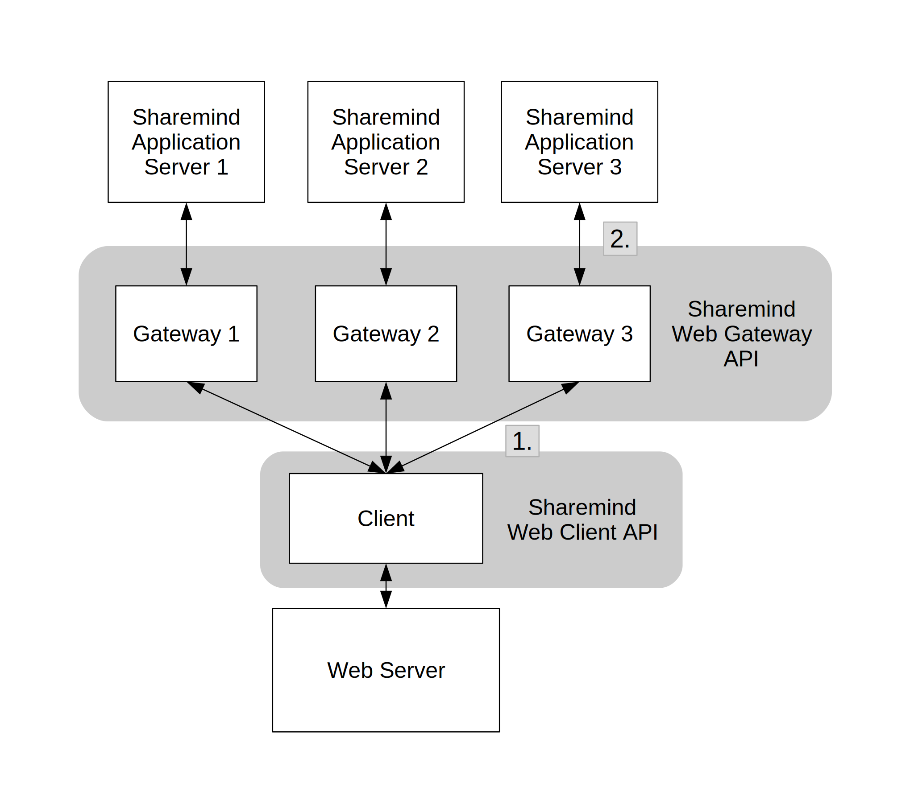

# Sharemind Web Application Tutorial

## Introduction

Sharemind Web Gateway (SWG) and Sharemind Web Client (SWC) are Node.js modules
for building web applications that use Sharemind MPC for privacy-preserving
computation. The SWG is used to build a gateway application that is hosted
together with each Sharemind Application Server to relay data and queries
between Sharemind and the web application. The SWC is used to secret share data
within the browser, send the secret shared data to Sharemind and call out SecreC
programs to handle said data.

This tutorial teaches how to create Sharemind web applications through a simple
example application. In the example application, web clients send their
geolocation data from the HTML5 Navigator API to the Sharemind servers in
secret-shared form. The servers store the data and calculate a histogram of
distances to other clients using secure computation. Since computing on
secret-shared values on Sharemind does not reveal the data, the Sharemind server
hosts or clients do not learn the location of any other clients.

## Setup

In a real-life deployment, a Sharemind MPC web application requires three
independent parties to run a Sharemind Application Server and a gateway
application in front of it. A webserver hosts the web application that uses
Sharemind MPC for secure computation. In this example application, all Sharemind
instances are run from the same host along with the gateways, and instead of a
webserver, the client-side HTML file is opened with a browser.

To run the example application, you will need the Sharemind MPC platform,
Sharemind Web Client and Web Gateway, Node.js of version 4 or above and NPM.
Node.js can be downloaded and installed from
[here](https://nodejs.org/en/download/package-manager/).

We will use a single project folder for the gateways and the web app. In the
`package.json` file, specify the location of the Web Client and Web Gateway NPM
packages in your file system. Run `npm install` in the project root directory to
install the necessary dependencies and copy them to the project's `node_modules`
folder.

Compile the SecreC program from the folder `secrec/` using `scc` and copy the
compiled bytecode to the SecreC programs folder of each Sharemind instance. When
compiling, include the SecreC Standard Library (usually installed in
`/usr/lib/sharemind/stdlib`).

In the folder `gateway/` make sure you have the correct keys and that the
configuration files are set up correctly for your Sharemind MPC deployment. The
server names, addresses and ports in the gateway configuration should match
those in the Sharemind Application Server configuration files. Run `sh
run_gateway.sh` to start the gateways. Then open `webserver/index.html` in your
browser.

## Application Walkthrough

The website queries the user's location data though the Navigator API. This
data is then secret shared in the browser and each share is sent to a gateway.
The website server doesn't see the original location value or the shares. After
the computation, Sharemind Application Servers return the resulting shares to
their gateway and the gateways relay it back to the browser. Only in the
browser are the result shares combined to reveal the value.


<div style="margin: auto; width: 100%; max-width: 600px; text-align: center;">
  <br>
  <i>1. Sharemind Web Client API secret-shares values and passes them to the Gateways.<br>
  2. Sharemind Web Gateway API executes a SecreC program on each Sharemind Application Server.</i>
</div>

### Gateway

The gateway is a Node.js application that runs in front of a Sharemind
Application Server. The gateway's source code can be found in the folder
`gateway/`. A shell script runs all three instances of the gateway with the
right configurations. The gateway requires the public key of it's Sharemind
server and the Sharemind server requires it's gateway's public key. The
gateway's public key must be added to the server's access policy file and
granted the right to execute this projects SecreC programs. For more on
Sharemind installation and access control, read
[here](https://docs.sharemind.cyber.ee/2019.03/installation/configuration).
For most use cases `gateway.js` should only be edited to add runnable SecreC
programs. The variable `scriptsInfoMap` contains an object for each program that
can be called by the web client. Only programs defined there can be run by
clients. Note that a different `scriptsInfoMap` can be used for different
clients.
```JavaScript
// Specify scripts that clients can run
// Client requests running computation 'location-database',
// upon which the script 'location-database.sb' is run
var scriptsInfoMap = {};
scriptsInfoMap['location-database'] = {
  name: 'location-database.sb',
  type: 'multi', // 'multi' means this script does MPC computations
  otherServerNames: otherServerNames
};
```

The function `gateway.handleNewClient` wraps the entire SecreC process
negotiation protocol. This function specifies which SecreC programs are allowed
to be executed by the client. More detailed information about the process
negotiation protocol and the rest of the Sharemind Web Gateway can be found in
the documentation that is included with the API.

### Web Client

The Web Client, in this case, is a single HTML file `webserver/index.html` that
contains the web page and JavaScript.  The HTML body contains a single button
that executes the function `getLocation()` and a div that will contain the
returned histogram.
```html
<body>
    <div id="in">
        <input type="button" value="Send" onclick="getLocation()">
    </div>
    <div id="out">
    </div>
</body>
```

In the head of the HTML file, three external JavaScript modules are included:
`socket.io`, `jsbn` and `sharemind-web-client`. Socket.io enables realtime
communication between the web client and the gateway servers, `jsbn` adds fast
large-number math to JavaScript and `sharemind-web-client` adds
Sharemind-specific capabilities such as secret sharing and SecreC program
execution. The location of these modules is specified in `package.json`.

The embedded JavaScript contains functions to get location data and send it to
the servers. The script also includes variables to support secret-sharing values
and communication with the gateways. The list `hosts` contains a string of the
IP address and port for each gateway. Because this example application is meant
to be run on the same device as the gateways, the IP addresses are `localhost`.
The variables `pub` and `priv` are Sharemind protection domains that are used to
create variables from those domains.
```JavaScript
var hosts = [
            "http://localhost:8081",
            "http://localhost:8082",
            "http://localhost:8083"
        	];
var gatewayConnection = null;
var pub = sm.types.base;
var priv = sm.types.shared3p;
```

In Sharemind MPC, all data are stored as arrays, behind the scenes, scalar
values are just arrays with a single element. Because of this, the Sharemind Web
Client only allows the creation of arrays. The available data types are:

* `IntNArray`
* `UintNArray`
* `XorUintNArray`
* `Float32Array`
* `Float64Array`

where N is 8, 16, 32 or 64. Variable length strings are only available as public
variables, for private bound length strings `XorUint8Array` is used internally
with a public `Uint64` that specifies the string bound. A string character can
be converted to a `jsbn` `BigInteger` that can be inserted into a `Uint8Array`.
That array must then be converted into a private `XorUint8Array`. The string
bound can be specified inside a SecreC program.
```javascript
//declare a public array with 3 elements
var public_value = new pub.Int64Array(3);
//set the first element to 900
public_value.set(0, 900);

//secret share the public array
var private_value = new priv.Int64Array(public_value)

//secre sharing a string value
var BigInteger = jsbn.BigInteger;
var name = "Michael";
var public_str = new pub.Uint8Array(name.length);

// convert each character in the string into a decimal number
for (var i = 0; i < name.length; i++) {
	public_str[i] = BigInteger(name[i], 10);
}

var private_str = new priv.XorUint8Array(public_str);

```

The function `getLocation()` is called when the user presses the `Send` button.
This function asks the user for permission to access their location data and
once it has received it, calls `sendLocation()`.
```JavaScript
function getLocation() {
    // this uses the HTML5 navigator api. For Chrome, version > 49 is required
    if (navigator.geolocation) {
        navigator.geolocation.getCurrentPosition(sendLocation);
    } else {
        console.log("Navigator API not available");
    }
}
```

A new gateway connection object is created with `new
sm.client.GatewayConnection(hosts)`, besides a list of gateway locations,
Socket.io options and a callback function can be given as optional arguments.
The connection is opened with `gatewayConnection.openConnection(callback(error,
serverInfos, prngSeed));`. A callback function is called once the connection is
established. The callback function should log connection errors, if a
pseudorandom number generator doesn't exist, it should create it. The callback
is also where the SecreC program should be executed. The function
`gatewayConnection.runMpcComputation(scriptName, arguments, callback(err,
results))` runs the specified program on the Sharemind servers with the given
arguments and calls the callback function once it has finished. The program
must be declared in `scriptsInfoMap` in `gateway.js`. The gateway connection is
closed at the end of execution since the user usually only executes one program
and leaving a connection hanging might promote errors later. The `send` button
opens a new connection in case it is needed. 
```JavaScript
function sendLocation(pos) {
    var longitude = toRadians(parseFloat(pos.coords.longitude));
    var latitude = toRadians(parseFloat(pos.coords.latitude));

    // write location data to console
    console.log(longitude);
    console.log(latitude);

    // create a new gateway connection
    gatewayConnection = new sm.client.GatewayConnection(hosts);

    // connect to gateways
    // once connections are established, secret share the data and run program
    gatewayConnection.openConnection(function(err, serverInfos, prngSeed) {
        // if an error accures
        if (err) {
            console.log("[ERROR] : " + err.message);
        }

        // if a pseudorandom number generator doesn't exist,
        // create one from the seed
        if (!sm.prng.instance) {
            sm.prng.init(prngSeed);
        }

        // create a public float64 array of size two and insert values into it
        var pub_value = new pub.Float64Array(2);
        pub_value.set(0, latitude);
        pub_value.set(1, longitude);

        // create a private float64 array from the public array
        var private_value = new priv.Float64Array(pub_value);
        var args = {};  // object holding arguments given to the script

        // insert private value into args,
        // the key string is used in the secrec program to get the value
        args["location"] = private_value;

        // run program "location-database",
        // after completion retrieve and format the result
        gatewayConnection.runMpcComputation("location-database",
                                            args, function(err, result) {
            console.log("Ran script");
            var res = result["hist"];  // the result is a public array of uint64

            // format the results
            document.getElementById("out").innerHTML = "<p>" +
                "People closer then 500m : " + res.get(0) + "<br>" +
                "People closer then 1km  : " + res.get(1) + "<br>" +
                "People closer then 2km  : " + res.get(2) + "<br>" +
                "People closer then 5km  : " + res.get(3) + "<br>" +
                "People further then 5km : " + res.get(4) + "<br>" +
                "</p>";

            gatewayConnection.close();
        })
    });
}
```

### SecreC program

The Sharemind Web Gateway can only execute SecreC programs on the application
server. Rmind programs can't be used to build web apps. To keep private values
secret, declassify should only be used to open values that don't leak any
information about the input. Computation results shouldn't be declassified as
this will reveal the value to the Sharemind hosts. Instead, results should be
published to the client. Detailed information about the SecreC language can be
found in the [official documentation](https://docs.sharemind.cyber.ee/2019.03/api/secrec-stdlib).

The SecreC program imports some modules from the SecreC Standard Library. Also,
a privacy domain named `pd_shared3p` is declared of the kind `shared3p`. This
means that variables of that domain are shared between three Sharemind
Application Servers and are secure in the presence of one passively corrupted
server.
```cpp
// import modules from the secrec standard library
// contains secret shared data types and regular functions like sin() and sqrt()
import shared3p;
// contains standard functions like publish() and print()
import stdlib;
// for creating table databases
import table_database;
// for inserting and retrieving secret shared values from databases
import shared3p_table_database;

domain pd_shared3p shared3p;  // create a protection domain of kind shared3p
```

When a SecreC program is run, the `void main()` function is called. Inside the
main function of the example application, a database connection is opened,
arguments are parsed, the result is calculated and published.
```cpp
// main function executed when the script is called
void main() {
	// datasource that is defined in the sharemind configuration
    public string ds = "DS1";
    // name of the table where the values will be stored
    public string table = "location-data";

    tdbOpenConnection(ds);

    createTable(ds, table);  // if the table doesn't exist yet, create it

    // retrieve the client's location data and
    // store it in secret shared double precision floats
    pd_shared3p float64[[1]] location = argument("location");
    pd_shared3p float64 latitude = location[0];
    pd_shared3p float64 longitude = location[1];

    // calculate the distance between the client's location and
    // all locations stored in the database
    // then create a histogram out of it
    pd_shared3p uint[[1]] hist = calculateDistanceHistogram(ds, table,
    														latitude, longitude);

    // publish the histogram so that it can be retrieved by the client
    publish("hist", hist);

    // store the client's location data in the database
    storeValue(ds, table, latitude, longitude);
    // close connection to the datasource, just in case it isn't done automatically
    tdbCloseConnection(ds);
}
```

The `createTable()` function, which is called in the `main()` function,
constructs a table database if one doesn't already exist. To create a table, a
vector map (vmap) with the column names and types is used. The function
`storeValue()` creates a vmap of values and adds them to the table database.
Read more about table databases and vector maps
[here](https://docs.sharemind.cyber.ee/2019.03/development/secrec-tutorial#using-the-table-database-interface).

SecreC supports C++ style
[templates](./secrec-reference#templates) that
allow the creation of domain type polymorphic functions. In the example
application, templates are used to make functions that accept inputs of any
`shared3p` protection domain.

In the function `calculateDistanceHistogram()` an
[approximation](https://en.wikipedia.org/wiki/Geographical_distance#Spherical_Earth_projected_to_a_plane)
is used to calculate the distance between two pairs of coordinates. To
[optimise](https://docs.sharemind.cyber.ee/2019.03/development/secrec-tutorial#writing-efficient-secrec) network
bandwith usage, calculations are done on arrays containing all the values in the
database. The Sharemind Application Servers recieve the arrays and do the
operations element wise.

Data is read from a table columnwise. This means two private arrays are
created, one for each column. The lenght of the table is not private and is
therefore save in a public `uint64`. Calculations are done on the inputs and
database columns in a privacy preserving manner and the results are saved in
private arrays. Comparison results for the histogram are also stored in private
boolean arrays. The function returns an array of type `uint64` that contains
the sums of the boolean arrays. The returned values are secret shared aswell
and are reconstructed by the client in the browser.

Because this function declares many arrays with the same size as the database,
it ends up allocating a lot of memory. In real life applications, where
possible, [standard library](https://docs.sharemind.cyber.ee/2019.03/api/secrec-stdlib) functions should be used
because of their optimised memory usage.
```cpp
// calculate the distances as if the earth was flat,
// this is accurate enough for this application
template<domain D : shared3p>
D uint[[1]] calculateDistanceHistogram(string datasource,
                                     string table,
                                     D float64 lat1,
                                     D float64 long1) {

    // read previously stored location data from the database, store it in two arrays
    pd_shared3p float64[[1]] lat2 = tdbReadColumn(datasource, table, "latitude");
    pd_shared3p float64[[1]] long2 = tdbReadColumn(datasource, table, "longitude");

    uint k = size(lat2);  // how many locations are stored in the database, public value
    float64 R = 6371;  // Earth's mean radius in kilometers

    // the calculations are done on arrays,
    // so that all distances can be calculated in parallel
    // this is more efficient than doing it in a for loop

    // calculate the distance between the client's coordinates and all other coordinates
    pd_shared3p float64[[1]] d_lat = lat2 - lat1;
    pd_shared3p float64[[1]] d_long = long2 - long1;

    // declare some arrays to store calculation results
    pd_shared3p float64[[1]] a(k);
    pd_shared3p float64[[1]] b(k);
    pd_shared3p float64[[1]] c(k);
    pd_shared3p float64[[1]] dist(k);

    // calculate the distances with the formula given in the wikipedia article
    a = d_lat * d_lat;
    b = (lat1 + lat2) / 2;
    c = cos(b) * d_long;
    dist = R * sqrt(a + c * c);

    // store boolean arrays of comparisons
    pd_shared3p bool[[1]] l05 = dist < 0.5;                // distance less than 0.5 km
    pd_shared3p bool[[1]] l1 = (dist < 1) & (dist > 0.5);  // distance less than 1.0 km
    pd_shared3p bool[[1]] l2 = (dist < 2) & (dist > 1.0);  // distance less than 2.0 km
    pd_shared3p bool[[1]] l5 = (dist < 5) & (dist > 2.0);  // distance less than 5.0 km
    pd_shared3p bool[[1]] m5 = dist > 5;                   // distance greater than 5.0

    // sum of a boolean array returns an unsigned integer
    // create an array from the sums of boolean arrays
    return {sum(l05), sum(l1), sum(l2), sum(l5), sum(m5)};
}
```
After the computation has concluded, the database connection is closed and the
results are published to the client. The `publish` function in SecreC means that
each Sharemind server sends their share to the client who can then reconstruct
the result.


